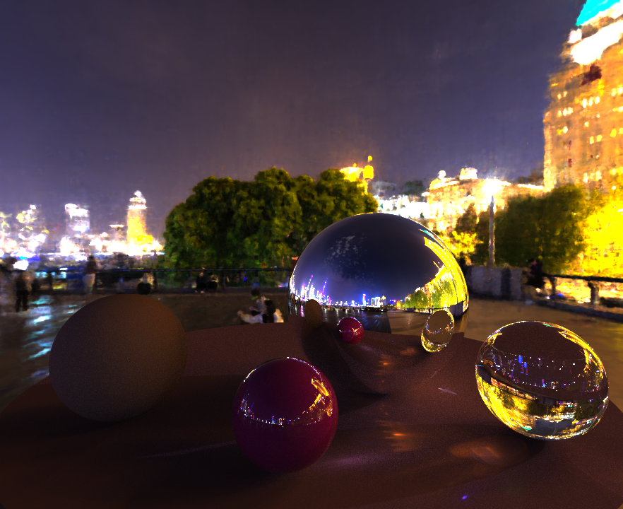

# Monte-Carlo Path Tracing on Graphcore IPUs



This is an experimental physically based renderer, it is experimental/novel in a few different ways:
- Executes on Graphcore IPUs (which are not nominally designed for rendering).
- It combines path tracing with "neural rendering": High-dynamic-range environment lighting is encoded in a small neural network.
  - The neural network and path tracer execute entirely out of on-chip SRAM.
- It is implemented in Poplar (a C++ graph programming framework design primarily as a backend for ML frameworks).
- It is a cloud renderer (since most IPU hardware is in remote data centres) and supports a remote user interface for interactive render preview.

This is a heavily modified fork of the simple path tracing example from [Graphcore's examples repository](https://github.com/graphcore/examples). 

### Repo structure

- `src/` C++ source code for the path tracing application.
  - `codelets/` IPU path tracing compute kernels.
  - `keras/` Code to load (limited) Keras models from HDF5 format.
  - `neural_networks/` Code to build adhoc neural networks in Poplar.
- `external/` Third party submodules.
  - `light/`: Basic C++ path tracing code.
  - `packetcomms/`: Low latency TCP/IP communication library.
  - `veideolib/`: Basic C++ wrapper for FFmpeg that supports sending video via packetcomms.
- `CMakeLists.txt` CMake build description.
- `README.md` This file.

## Building and Running

This application has been tested on Ubuntu 18 based IPU machines only. It has a number of system dependencies so the recommended way to build and run it is using a Docker container. If you prefer not to use Docker you can still look inside the Dockerfile used below to see how to configure your system (e.g. which apt packages are required).

### Setup your Poplar SDK and IPU Partition

To use Docker with IPUs we first need to install `gc-docker`. This can be found in the Poplar SDK, install this on your machine following Graphcore's instructions: [Poplar SDK Installation](https://docs.graphcore.ai/projects/ipu-pod-getting-started/en/latest/installation.html).

Additionally, if it has not been configured for you, you must also setup your IPU partition configuration file following the guidance for your system: [VIPU Getting Started](https://docs.graphcore.ai/projects/vipu-user/en/latest/getting_started.html). (In the rest of this document we assume the partition config file is in: `~/.ipuof.conf.d`).

Poplar SDK version support:

| SDK Version | Supported |
|-|-|
|< 2.5| No |
| 2.5 | Limited - Single IPU only |
| 2.6 | Yes |
| 3.0 | Yes |

### Build a Docker Image

Clone the docker file, build the image, and make yourself a data volume to keep your work:
```
git clone https://github.com/markp-gc/docker-files.git
docker build -t ipu_path_trace/dev --build-arg CUSTOM_SSH_PORT=2222 docker-files/graphcore/path_trace_devel/
docker volume create $USER-path-trace-data
```

Now we can launch the container:
```
gc-docker -- -it --rm --name "$USER"_ipu_docker -v $USER-path-trace-data:/home/ubuntu/ --tmpfs /tmp:exec -v ~/.ipuof.conf.d:/etc/ipuof.conf.d/ ipu_path_trace/dev
```

(For remote development in the container Visual Studio Code with the official [remote development extension](https://marketplace.visualstudio.com/items?itemName=ms-vscode-remote.vscode-remote-extensionpack) is recommended).

### Build the Application

In your container you can now clone and build this repository:
```
git clone --recursive https://github.com/markp-gc/ipu_path_trace
mkdir -p ipu_path_trace/build
cd ipu_path_trace/build
cmake -G Ninja ..
ninja -j64
```

This should build all the submodules and the application.

### Run the Application

The application needs a neural HDRI model to run. There is an example included in the repository that you can try:
```
./ipu_trace --assets ../nif_models/urban_alley_01_4k_fp16_yuv/assets.extra/ -w 1104 -h 1000 -s 100000 --samples-per-step 300 --ipus 1 --defer-attach -o image.png --save-interval 10 --save-exe pt_graph
```
The renderer saves low and high dynamic range outputs intermittently (`--save-interval`) in this case: `image.png` and `image.exr`.

## Train your own Environment Lighting Network

The neural environment light uses a neural image field (NIF) network. These are MLP based image approximators and are trained using Graphcore's NIF implementation: [NIF Training Scripts](https://github.com/graphcore/examples/tree/master/vision/neural_image_fields/tensorflow2).
Before you start a training run you will need to source an equirectangular-projection HDRI image (e.g. those found here are suitable: [HDRIs](https://polyhaven.com/hdris)). Download a 2k or 4k image and pass it to the NIF traning script('--input'). You can play with the hyper parameters
but the parameters below are a balanced compromise between size, computational cost and quality:

```
git clone https://github.com/graphcore/examples.git
cd examples/vision/neural_image_fields/tensorflow2
pip install -r requirements.txt
python3 train_nif.py --train-samples 8000000 --epochs 1000 --callback-period 100 --fp16 --loss-scale 16384 --color-space yuv --layer-count 6 --layer-size 320 --batch-size 1024 --callback-period 100 --embedding-dimension 12 --input input_hdri.exr --model nif_models/output_nif_fp16_yuv
```

The trained keras model contains a subfolder called `assets.extra`, give that path to the path tracer using the `--assets` command line option.

## Remote User Interface

The application supports a remote user interface that allows you to change render settings and interactively preview the results. This is available in a separate repository here: [remote render user interface](https://github.com/markp-gc/remote_render_ui). If you specify a port in the path tracer options using `--ui-port` then the application will wait for the remote-ui to connect (after graph compilation/load). E.g. to load the path-tracer compute graph that you compiled above and launch in interactive mode just run:

```
./ipu_trace --assets ../nif_models/urban_alley_01_4k_fp16_yuv/assets.extra/ -w 1104 -h 1000 -s 100000 --ipus 1 --defer-attach -o image.png --save-interval 10 --load-exe pt_graph --samples-per-step 64 --ui-port 5000
```

(Note that we are now passing `--load-exe` and the peak samples per step was lowered to reduce interaction latency). Once you see the following log line: `User interface server listening on port 5000` you can connect the remote user interface from your local machine.
```
./remote-ui --host localhost --port 5000
```

NOTE: You will need to forward the specified port to your local machine so the UI can connect e.g.:

```
ssh -NL 5000:localhost:5000 <hostname-of-ipu-head-node> &
```
